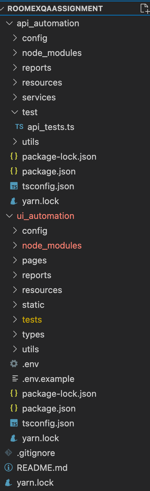
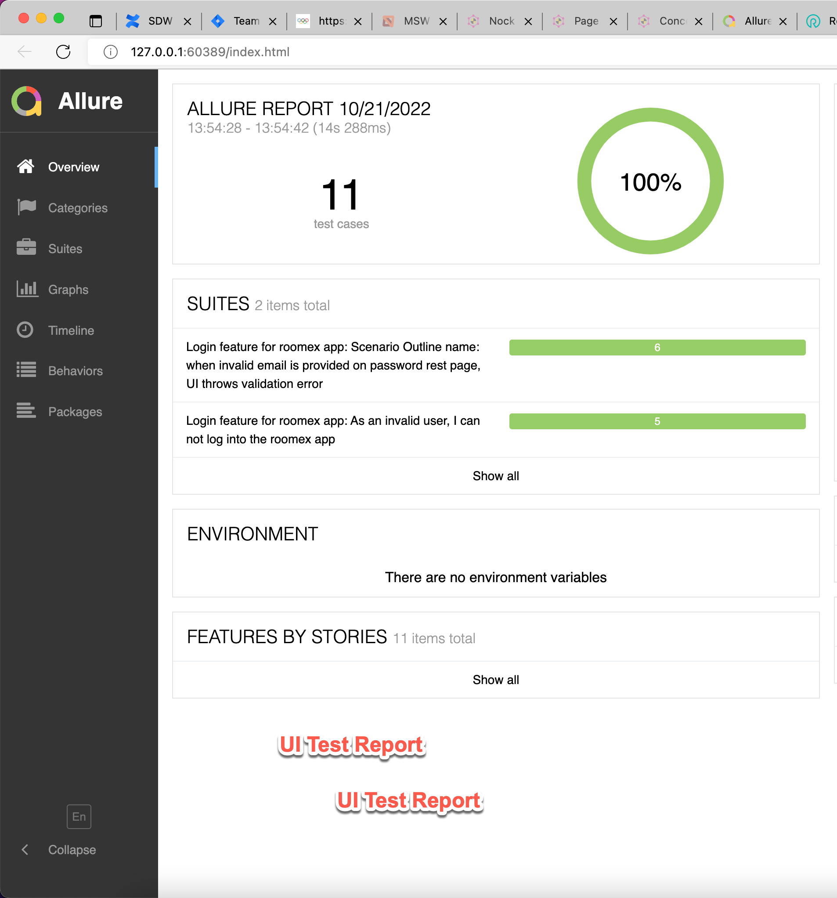
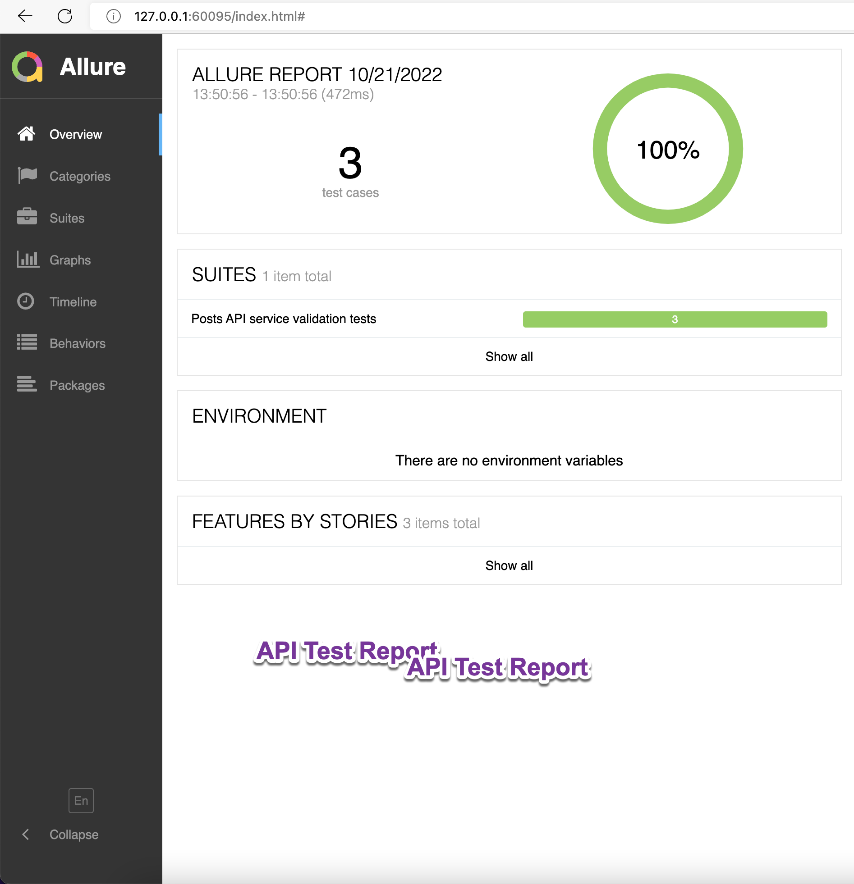

<h2 align="center"> Roomex Test Automation Framework </h2>

<h4 align="center">
</h4>

#### Requirements
* NodeJS
* JDK
* VisualStudioCode

#### Clone Repository
```bash
1. git clone PROVIDE URL
2. Navigate to `RoomexQAAssignment`
```
-----

### Running UI Tests
Install dependencies:
> Switch to the "ui-automation" folder and then run below command
```bash
yarn install
```

Setup .env file:<br>
create `.env` file inside ui_automation folder and update content with reference to `.env.example`

Run test in local:
> By default test will run in Chrome browser.
> Update MODE=LOCAL in .env file to see test running in browser.
```bash
yarn run test:ui     [ Cucumber BDD tests ]
```

Generate Report:
```bash
yarn report:allure
```
-----

### Running API Tests
Install dependencies:
> Navigate to "api-automation" folder and then run below command
```bash
yarn install
```

Run test:
```bash
yarn test:api
```

Generate Report:
```bash
yarn report:allure
```


-----

#### Features
    - Web and API Testing
    - Cucumber BDD framework
    - Page Object Design pattern
    - Screenshot in report for failed tests
    - Use of types for method params optimization
    - Improved import statement using tsconfig path

#### Framework Structure
    

#### Test Reports

### UI Test Report
    

#### API Test Report
    


#### Tech stacks:
[](https://webdriver.io/)
[](https://www.typescriptlang.org/)
[](https://mochajs.org/)
[](https://cucumber.io/)
[](https://www.chaijs.com/)
[](https://github.com/visionmedia/supertest)

